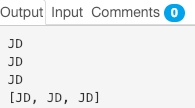
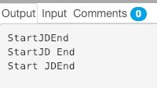

<h1 align="center">Java 11 Features</h1>

We haven’t fully immersed ourselves in Java 10 yet, and Java 11 is here. Java 11 is important for more than just a few reasons. Oracle has revamped its support model and come up with a release train that’ll bring rapid updates, about every 6 months.

They’ve changed the licensing and support model which means if you download the Java 11 Oracle JDK, it will be paid for commercial use.

Does that mean that I need to pay for Java from now on?
**NO.** Not necessarily unless you download the Oracle JDK and use it in production.

**Note**: IntelliJ IDEA 2018.2.4 Community Edition already has support for Java 11.

Table of Contents[[hide](https://www.journaldev.com/24601/java-11-features#)]

- [1 1. Why is Java 11 important?](https://www.journaldev.com/24601/java-11-features#1-why-is-java-11-important)
- [2 2. Which JDK build should I download and what are the benefits of each of them?](https://www.journaldev.com/24601/java-11-features#2-which-jdk-build-should-i-download-and-what-are-the-benefits-of-each-of-them)
- [3 3. How to download Java 11 Free Version?](https://www.journaldev.com/24601/java-11-features#3-how-to-download-java-11-free-version)
- 4 4. Java 11 Features
  - [4.1) Running Java File with single command](https://www.journaldev.com/24601/java-11-features#41-running-java-file-with-single-command)
  - [4.2) Java String Methods](https://www.journaldev.com/24601/java-11-features#42-java-string-methods)
  - [4.3) Local-Variable Syntax for Lambda Parameters](https://www.journaldev.com/24601/java-11-features#43-local-variable-syntax-for-lambda-parameters)
  - [4.4) Nested Based Access Control](https://www.journaldev.com/24601/java-11-features#44-nested-based-access-control)
  - [4.5) JEP 309: Dynamic Class-File Constants](https://www.journaldev.com/24601/java-11-features#45-jep-309-dynamic-class-file-constants)
  - [4.6) JEP 318: Epsilon: A No-Op Garbage Collector](https://www.journaldev.com/24601/java-11-features#46-jep-318-epsilon-a-no-op-garbage-collector)
  - [4.7) JEP 320: Remove the Java EE and CORBA Modules](https://www.journaldev.com/24601/java-11-features#47-jep-320-remove-the-java-ee-and-corba-modules)
  - [4.8) JEP 328: Flight Recorder](https://www.journaldev.com/24601/java-11-features#48-jep-328-flight-recorder)
  - [4.9) JEP 321: HTTP Client](https://www.journaldev.com/24601/java-11-features#49-jep-321-http-client)
  - [4.10) Reading/Writing Strings to and from the Files](https://www.journaldev.com/24601/java-11-features#410-readingwriting-strings-to-and-from-the-files)
  - [4.11) JEP 329: ChaCha20 and Poly1305 Cryptographic Algorithms](https://www.journaldev.com/24601/java-11-features#411-jep-329-chacha20-and-poly1305-cryptographic-algorithms)
  - [4.12) JEP 315: Improve Aarch64 Intrinsics](https://www.journaldev.com/24601/java-11-features#412-jep-315-improve-aarch64-intrinsics)
  - [4.13) JEP 333: ZGC: A Scalable Low-Latency Garbage Collector (Experimental)](https://www.journaldev.com/24601/java-11-features#413-jep-333-zgc-a-scalable-low-latency-garbage-collector-experimental)
  - [4.14) JEP 335: Deprecate the Nashorn JavaScript Engine](https://www.journaldev.com/24601/java-11-features#414-jep-335-deprecate-the-nashorn-javascript-engine)
- [5 5. Conclusion](https://www.journaldev.com/24601/java-11-features#5-conclusion)

## 1. Why is Java 11 important?

Java 11 is the second LTS release after [Java 8](https://www.journaldev.com/2389/java-8-features-with-examples). Since Java 11, Oracle JDK would no longer be free for commercial use.

You can use it in developing stages but to use it commercially, you need to buy a license. If you don’t, you can get an invoice bill from Oracle any day!

[Java 10](https://www.journaldev.com/20395/java-10-features) was the last free Oracle JDK that could be downloaded.

Oracle stops [Java 8](https://www.journaldev.com/2389/java-8-features-with-examples) support from January 2019. You’ll need to pay for more support.
You can continue using it, but won’t get any patches/security updates.

Oracle will not be providing free long-term support (LTS) for any single Java version since Java 11.

While Oracle JDK is no longer free, you can always download the Open JDK builds from Oracle or other providers such as AdoptOpenJDK, Azul, IBM, Red Hat, etc. In my opinion, unless you are looking for Enterprise level usage with the appetite to pay for the support fees, you can use [OpenJDK](https://openjdk.java.net/) and upgrade them as and when necessary.

## 2. Which JDK build should I download and what are the benefits of each of them?

Since Oracle has created a release train in which a new version would come up every six months, if you are using the free Open JDK by Oracle, you will need to update it every six months, since Oracle won’t provide free updates once the new version is released. This can be challenging to adapt to a company.

Pay for commercial support to Oracle and migrate only from one LTS version to the next LTS version.
This way you’ll get all the updates and support for Java 11 till 2026. You can download Java 17 in 2022.

Stay on free Java version even after its support ends. Though you won’t get security updates and it can open up security loopholes.

Oracle won’t provide commercial support or updates for [Java 9](https://www.journaldev.com/13121/java-9-features-with-examples) and Java 10. You need to look for other alternative builds in order to keep using them for free.

Having understood the baggage Java 11 comes with, lets now analyze the important features in Java 11 for developers. We’ll discuss some important JEPs too.

Note: JavaFX will be available as a separate module and not tied to Java JDK’s 6-month release cycle schedule.

## 3. How to download Java 11 Free Version?

You can download production ready OpenJDK version from this [link](https://jdk.java.net/11/). The binaries are in tar or zip format, so just unzip them and set the environment variables to use java compiler and java commands.

## 4. Java 11 Features

Some of the important Java 11 features are:

- Running Java File with single command
- New utility methods in String class
- Local-Variable Syntax for Lambda Parameters
- Nested Based Access Control
- JEP 321: HTTP Client
- Reading/Writing Strings to and from the Files
- JEP 328: Flight Recorder

Let’s discuss the new features introduced with Java 11 from the JEP Process.

### 4.1) Running Java File with single command

One major change is that you don’t need to compile the java source file with `javac` tool first. You can directly run the file with **java** command and it implicitly compiles.
This feature comes under JEP 330.

Following is a sneak peek at the new methods of [Java String](https://www.journaldev.com/16928/java-string) class introduced in Java 11:

### 4.2) Java String Methods

**isBlank()** – This instance method returns a boolean value. Empty Strings and Strings with only white spaces are treated as blank.

```
import java.util.*;

public class Main {
    public static void main(String[] args) throws Exception {
        // Your code here!
        
        System.out.println(" ".isBlank()); //true
        
        String s = "Anupam";
        System.out.println(s.isBlank()); //false
        String s1 = "";
        System.out.println(s1.isBlank()); //true
    }
}
```

**lines()**

This method returns a stream of strings, which is a collection of all substrings split by lines.

```
import java.util.stream.Collectors;

public class Main {
    public static void main(String[] args) throws Exception {
        
        String str = "JD\nJD\nJD"; 
        System.out.println(str);
        System.out.println(str.lines().collect(Collectors.toList()));
    }
}
```

The output of the above code is:




**strip(), stripLeading(), stripTrailing()**

`strip()` – Removes the white space from both, beginning and the end of string.

**But we already have trim(). Then what’s the need of strip()?**


`strip()` is “Unicode-aware” evolution of `trim()`.

When `trim()` was introduced, Unicode wasn’t evolved. Now, the new strip() removes all kinds of whitespaces leading and trailing(check the method `Character.isWhitespace(c)` to know if a unicode is whitespace or not)

An example using the above three methods is given below:

```
public class Main {
    public static void main(String[] args) throws Exception {
        // Your code here!
        
        String str = " JD "; 
        System.out.print("Start");
        System.out.print(str.strip());
        System.out.println("End");
        
        System.out.print("Start");
        System.out.print(str.stripLeading());
        System.out.println("End");
        
        System.out.print("Start");
        System.out.print(str.stripTrailing());
        System.out.println("End");
    }
}
```

The output in the console from the above code is:




**repeat(int)**

The repeat method simply repeats the string that many numbers of times as mentioned in the method in the form of an int.

```
public class Main {
    public static void main(String[] args) throws Exception {
        // Your code here!
        
        String str = "=".repeat(2);
        System.out.println(str); //prints ==
    }
}
```

### 4.3) Local-Variable Syntax for Lambda Parameters

**JEP 323**, Local-Variable Syntax for [Lambda](https://www.journaldev.com/16703/java-lambda-expression) Parameters is the only language feature release in Java 11.
In Java 10, [Local Variable Type Inference](https://www.journaldev.com/19871/java-10-local-variable-type-inference) was introduced. Thus we could infer the type of the variable from the RHS – `var list = new ArrayList();`

JEP 323 allows `var` to be used to declare the formal parameters of an implicitly typed lambda expression.

We can now define :

```
(var s1, var s2) -> s1 + s2
```

This was possible in Java 8 too but got removed in Java 10. Now it’s back in Java 11 to keep things uniform.

**But why is this needed when we can just skip the type in the lambda?**
If you need to apply an annotation just as @Nullable, you cannot do that without defining the type.

**Limitation of this feature** – You must specify the type var on all parameters or none.
Things like the following are not possible:

```
(var s1, s2) -> s1 + s2 //no skipping allowed
(var s1, String y) -> s1 + y //no mixing allowed

var s1 -> s1 //not allowed. Need parentheses if you use var in lambda.
```

### 4.4) Nested Based Access Control

Before Java 11 this was possible:

```
public class Main {
 
    public void myPublic() {
    }
 
    private void myPrivate() {
    }
 
    class Nested {
 
        public void nestedPublic() {
            myPrivate();
        }
    }
}
```

private method of the main class is accessible from the above-nested class in the above manner.
But if we use [Java Reflection](https://www.journaldev.com/1789/java-reflection-example-tutorial), it will give an `IllegalStateException`.

```
Method method = ob.getClass().getDeclaredMethod("myPrivate");
method.invoke(ob);
```

Java 11 nested access control addresses this concern in reflection.
`java.lang.Class` introduces three methods in the reflection API: `getNestHost()`, `getNestMembers()`, and `isNestmateOf()`.

### 4.5) JEP 309: Dynamic Class-File Constants

The Java class-file format now extends support a new constant pool form, CONSTANT_Dynamic. The goal of this JEP is to reduce the cost and disruption of developing new forms of materializable class-file constraints, by creating a single new constant-pool form that can be parameterized with user-provided behavior.
This enhances performance

### 4.6) JEP 318: Epsilon: A No-Op Garbage Collector

Unlike the JVM GC which is responsible for allocating memory and releasing it, Epsilon only allocates memory.
It allocates memory for the following things:

- Performance testing.
- Memory pressure testing.
- VM interface testing.
- Extremely short lived jobs.
- Last-drop latency improvements.
- Last-drop throughput improvements.

Now Elipson is good only for test environments. It will lead to [OutOfMemoryError](https://www.journaldev.com/21010/java-lang-outofmemoryerror-java-heap-space) in production and crash the applications.

The benefit of Elipson is no memory clearance overhead. Hence it’ll give an accurate test result of performance and we can no longer GC for stopping it.

Note: This is an experimental feature.

### 4.7) JEP 320: Remove the Java EE and CORBA Modules

The modules were already deprecated in Java 9. They are now completely removed.

Following packages are removed: `java.xml.ws`, `java.xml.bind`, `java.activation`, `java.xml.ws.annotation`, `java.corba`, `java.transaction`, `java.se.ee`, `jdk.xml.ws`, `jdk.xml.bind`

### 4.8) JEP 328: Flight Recorder

Flight Recorder which earlier used to be a commercial add-on in Oracle JDK is now open-sourced since Oracle JDK is itself not free anymore.

JFR is a profiling tool used to gather diagnostics and profiling data from a running Java application.
Its performance overhead is negligible and that’s usually below 1%. Hence it can be used in production applications.

### 4.9) JEP 321: HTTP Client

Java 11 standardizes the Http CLient API.
The new API supports both HTTP/1.1 and HTTP/2. It is designed to improve the overall performance of sending requests by a client and receiving responses from the server. It also natively supports WebSockets.

### 4.10) Reading/Writing Strings to and from the Files

Java 11 strives to make reading and writing of String convenient.
It has introduced the following methods for reading and writing to/from the files:

- readString()
- writeString()

Following code showcases an example of this

```
Path path = Files.writeString(Files.createTempFile("test", ".txt"), "This was posted on JD");
System.out.println(path);
String s = Files.readString(path);
System.out.println(s); //This was posted on JD
```

### 4.11) JEP 329: ChaCha20 and Poly1305 Cryptographic Algorithms

Java 11 provides ChaCha20 and ChaCha20-Poly1305 cipher implementations. These algorithms will be implemented in the SunJCE provider.

### 4.12) JEP 315: Improve Aarch64 Intrinsics

Improve the existing string and array intrinsics, and implement new intrinsics for the java.lang.Math sin, cos, and log functions, on AArch64 processors.

### 4.13) JEP 333: ZGC: A Scalable Low-Latency Garbage Collector (Experimental)

Java 11 has introduced a low latency GC. This is an experimental feature.
It’s good to see that Oracle is giving importance to GC’s.

### 4.14) JEP 335: Deprecate the Nashorn JavaScript Engine

Nashorn JavaScript script engine and APIs are deprecated thereby indicating that they will be removed in the subsequent releases.

## 5. Conclusion

We’ve gone through the important features and updates provided in Java 11. See you soon when Java 12 releases.


source： https://www.journaldev.com/24601/java-11-features