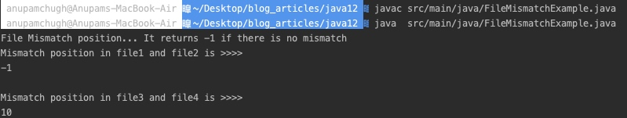
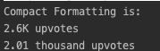

<h1 align="center">Java 12 Features</h1>

Finally, JDK 12 which is a part of the six-month release cycle, is here. It comes after the last Java LTS version 11. We had discussed at length on [Java 11 features](https://www.journaldev.com/24601/java-11-features) before. Today we’ll be discussing Java 12 features and see what it has in store for developers.

Java 12 was launched on March 19, 2019. It is a Non-LTS version. Hence it won’t have long term support.

Table of Contents[[hide](https://www.journaldev.com/28666/java-12-features#)]

- [1 Java 12 Features](https://www.journaldev.com/28666/java-12-features#java-12-features)
- 2 JVM Changes
  - [2.1 1. JEP 189 – Shenandoah: A Low-Pause-Time Garbage Collector (Experimental)](https://www.journaldev.com/28666/java-12-features#1-jep-189-8211-shenandoah-a-low-pause-time-garbage-collector-experimental)
  - [2.2 2. JEP 346 – Promptly Return Unused Committed Memory from G1](https://www.journaldev.com/28666/java-12-features#2-jep-346-8211-promptly-return-unused-committed-memory-from-g1)
  - [2.3 3. JEP 344 : Abortable Mixed Collections for G1](https://www.journaldev.com/28666/java-12-features#3-jep-344-abortable-mixed-collections-for-g1)
  - [2.4 4. JEP 230 and 344](https://www.journaldev.com/28666/java-12-features#4-jep-230-and-344)
  - [2.5 5. JEP 341 Default CDS Archives](https://www.journaldev.com/28666/java-12-features#5-jep-341-default-cds-archives)
- 3 Language Changes And Features
  - [3.1 1. Switch Expressions (Preview)](https://www.journaldev.com/28666/java-12-features#1-switch-expressions-preview)
  - [3.2 2. File.mismatch method](https://www.journaldev.com/28666/java-12-features#2-filemismatch-method)
  - [3.3 3. Compact Number Formatting](https://www.journaldev.com/28666/java-12-features#3-compact-number-formatting)
  - [3.4 4. Teeing Collectors](https://www.journaldev.com/28666/java-12-features#4-teeing-collectors)
  - [3.5 5. Java Strings New Methods](https://www.journaldev.com/28666/java-12-features#5-java-strings-new-methods)
  - [3.6 6. JEP 334: JVM Constants API](https://www.journaldev.com/28666/java-12-features#6-jep-334-jvm-constants-api)
  - [3.7 7. JEP 305: Pattern Matching for instanceof (Preview)](https://www.journaldev.com/28666/java-12-features#7-jep-305-pattern-matching-for-instanceof-preview)

## Java 12 Features

Some of the important Java 12 features are;

1. JVM Changes – JEP 189, JEP 346, JEP 344, and JEP 230.
2. Switch Expressions
3. File mismatch() Method
4. Compact Number Formatting
5. Teeing Collectors in Stream API
6. Java Strings New Methods – indent(), transform(), describeConstable(), and resolveConstantDesc().
7. JEP 334: JVM Constants API
8. JEP 305: Pattern Matching for instanceof
9. Raw String Literals is Removed From JDK 12.

Let’s look into all these Java 12 features one by one.

## JVM Changes

### 1. JEP 189 – Shenandoah: A Low-Pause-Time Garbage Collector (Experimental)

RedHat initiated Shenandoah Garbage Collector to reduce GC pause times. The idea is to run GC concurrently with the running Java threads.

It aims at consistent and predictable short pauses irrelevant of the heap size. So it does not matter if the heap size is 15 MB or 15GB.

It is an experimental feature in Java 12.

### 2. JEP 346 – Promptly Return Unused Committed Memory from G1

Stating Java 12, G1 will now check [Java Heap memory](https://www.journaldev.com/4098/java-heap-space-vs-stack-memory) during inactivity of application and return it to the operating system. This is a preemptive measure to conserve and use free memory.

### 3. JEP 344 : Abortable Mixed Collections for G1

Improvements in G1 efficiency include making G1 mixed collections abortable if they might exceed the defined pause target. This is done by splitting the mixed collection set into mandatory and optional.
Thus the G1 collector can prioritize on collecting the mandatory set first to meet the pause time goal.

### 4. JEP 230 and 344

**Microbenchmark Suite, JEP 230** feature adds a basic suite of microbenchmarks to the JDK source code. This makes it easy for developers to run existing microbenchmarks and create new ones.

**One AArch64 Port, Not Two, JEP 344**, removes all of the sources related to the arm64 port while retaining the 32-bit ARM port and the 64-bit aarch64 port. This allows contributors to focus their efforts on a single 64-bit ARM implementation

### 5. JEP 341 Default CDS Archives

This enhances the JDK build process to generate a class data-sharing (CDS) archive, using the default class list, on 64-bit platforms. The goal is to improve startup time. From Java 12, CDS is by default ON.

To run your program with CDS turned off do the following:

```
java -Xshare:off HelloWorld.java
```

Now, this would delay the startup time of the program.

## Language Changes And Features

Java 12 has introduced many language features. Let us look at a few with implementations.

### 1. Switch Expressions (Preview)

Java 12 has enhanced Switch expressions for Pattern matching.
Introduced in [JEP 325](https://openjdk.java.net/jeps/325), as a preview language feature, the new Syntax is `L ->`.

Following are some things to note about Switch Expressions:

- The new Syntax removes the need for break statement to prevent fallthroughs.
- Switch Expressions don’t fall through anymore.
- Furthermore, we can define multiple constants in the same label.
- `default` case is now compulsory in Switch Expressions.
- `break` is used in Switch Expressions to return values from a case itself.

Classic switch statement:

```
String result = "";
        switch (day) {
            case "M":
            case "W":
            case "F": {
                result = "MWF";
                break;
            }
            case "T":
            case "TH":
            case "S": {
                result = "TTS";
                break;
            }
        };

        System.out.println("Old Switch Result:");
        System.out.println(result);
```

With the new Switch expression, we don’t need to set break everywhere thus prevent logic errors!

```
String result = switch (day) {
            case "M", "W", "F" -> "MWF";
            case "T", "TH", "S" -> "TTS";
            default -> {
                if(day.isEmpty())
                    break "Please insert a valid day.";
                else
                    break "Looks like a Sunday.";
            }

        };

        System.out.println(result);
```

Let’s run the below program containing the new Switch Expression using JDK 12.

```
public class SwitchExpressions {

    public static void main(String[] args)
    {
        System.out.println("New Switch Expression result:");
        executeNewSwitchExpression("M");
        executeNewSwitchExpression("TH");
        executeNewSwitchExpression("");
        executeNewSwitchExpression("SUN");
    }

    public static void executeNewSwitchExpression(String day){

        String result = switch (day) {
            case "M", "W", "F" -> "MWF";
            case "T", "TH", "S" -> "TTS";
            default -> {
                if(day.isEmpty())
                    break "Please insert a valid day.";
                else
                    break "Looks like a Sunday.";
            }

        };

        System.out.println(result);
    }
}
```

Since this is a preview feature, please ensure that you have selected the Language Level as Java 12 preview.
To compile the above code run the following command:


```
javac -Xlint:preview --enable-preview -source 12 src/main/java/SwitchExpressions.java
```

After running the compiled program, we get the following in the console


Java Switch Expressions Program Output

Switch expressions is a **preview language feature**. This means that even though it is complete, it may not be confirmed in the future Java Release.

### 2. File.mismatch method

Java 12 added the following method to compare two files:

```
public static long mismatch(Path path, Path path2) throws IOException
```

This method returns the position of the first mismatch or -1L if there is no mismatch.

Two files can have a mismatch in the following scenarios:

- If the bytes are not identical. In this case, the position of the first mismatching byte is returned.
- File sizes are not identical. In this case, the size of the smaller file is returned.

Example code snippet from IntelliJ Idea is given below:

```
import java.io.IOException;
import java.nio.file.Files;
import java.nio.file.Path;

public class FileMismatchExample {

    public static void main(String[] args) throws IOException {
        Path filePath1 = Files.createTempFile("file1", ".txt");
        Path filePath2 = Files.createTempFile("file2", ".txt");
        Files.writeString(filePath1,"JournalDev Test String");
        Files.writeString(filePath2,"JournalDev Test String");

        long mismatch = Files.mismatch(filePath1, filePath2);

        System.out.println("File Mismatch position... It returns -1 if there is no mismatch");

        System.out.println("Mismatch position in file1 and file2 is >>>>");
        System.out.println(mismatch);

        filePath1.toFile().deleteOnExit();
        filePath2.toFile().deleteOnExit();

        System.out.println();

        Path filePath3 = Files.createTempFile("file3", ".txt");
        Path filePath4 = Files.createTempFile("file4", ".txt");
        Files.writeString(filePath3,"JournalDev Test String");
        Files.writeString(filePath4,"JournalDev.com Test String");

        long mismatch2 = Files.mismatch(filePath3, filePath4);

        System.out.println("Mismatch position in file3 and file4 is >>>>");
        System.out.println(mismatch2);

        filePath3.toFile().deleteOnExit();
        filePath4.toFile().deleteOnExit();


    }

}
```

The output when the above Java Program is compiled and run is:


Java File Mismatch Example Program Output

### 3. Compact Number Formatting

```
import java.text.NumberFormat;
import java.util.Locale;

public class CompactNumberFormatting {


    public static void main(String[] args)
    {
        System.out.println("Compact Formatting is:");
        NumberFormat upvotes = NumberFormat
                .getCompactNumberInstance(new Locale("en", "US"), NumberFormat.Style.SHORT);
        upvotes.setMaximumFractionDigits(1);

        System.out.println(upvotes.format(2592) + " upvotes");


        NumberFormat upvotes2 = NumberFormat
                .getCompactNumberInstance(new Locale("en", "US"), NumberFormat.Style.LONG);
        upvotes2.setMaximumFractionDigits(2);
        System.out.println(upvotes2.format(2011) + " upvotes");
    }


}
```

Java Compact Number Formatting Program Output

### 4. Teeing Collectors

Teeing Collector is the new collector utility introduced in the Streams API.

This collector has three arguments – Two collectors and a Bi-function.
All input values are passed to each collector and the result is available in the Bi-function.

```
double mean = Stream.of(1, 2, 3, 4, 5)
                .collect(Collectors.teeing(
                        summingDouble(i -> i),
                        counting(),
                        (sum, n) -> sum / n));

System.out.println(mean);
```

The output is **3.0**.

### 5. Java Strings New Methods

4 new methods have been introduced in Java 12 which are:

- indent(int n)
- transform(Function f)
- Optional describeConstable()
- String resolveConstantDesc(MethodHandles.Lookup lookup)

To know about the above methods and there implementation in detail, refer to our [Java 12 String Methods](https://www.journaldev.com/28673/java-12-string-methods) tutorial.

### 6. JEP 334: JVM Constants API

A new package `java.lang.constant` is introduced with this JEP. This is not that useful for those developers who don’t use constants pool.

### 7. JEP 305: Pattern Matching for instanceof (Preview)

Another Preview Language feature!

The old way to typecast a type to another type is:

```
if (obj instanceof String) {
    String s = (String) obj;
    // use s in your code from here
}
```

The new way is :

```
if (obj instanceof String s) {
    // can use s directly here
} 
```

This saves us some typecasting which were unnecessary.

Raw String Literals is Removed From JDK 12.

That brings an end to this article on Java 12 features.


source： https://www.journaldev.com/28666/java-12-features