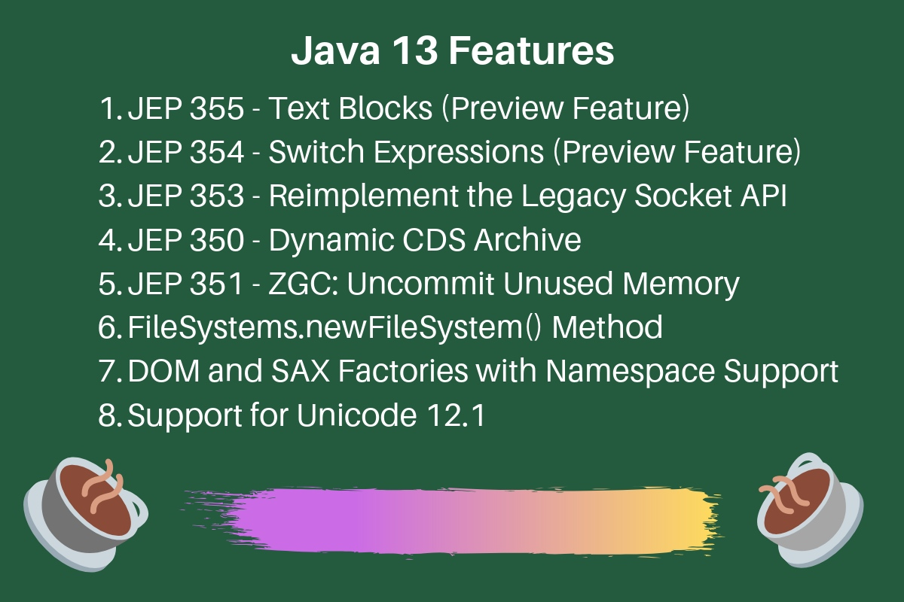
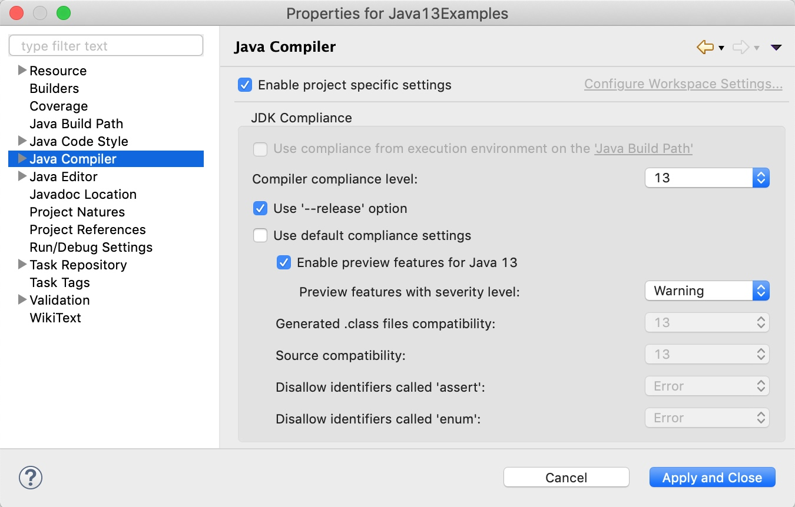

<h1 align="center">Java 13 Features</h1>




Java 13 was released for production use on 17th September 2019. There are not a lot of developer-specific features in Java 13 because of the 6-month release cycle.

Table of Contents[[hide](https://www.journaldev.com/33204/java-13-features#)]

- [1 Java 13 Features](https://www.journaldev.com/33204/java-13-features#java-13-features)
- [2 How to Enable Preview Features](https://www.journaldev.com/33204/java-13-features#how-to-enable-preview-features)
- [3 1. Text Blocks – JEP 355](https://www.journaldev.com/33204/java-13-features#1-text-blocks-8211-jep-355)
- [4 2. New Methods in String Class for Text Blocks](https://www.journaldev.com/33204/java-13-features#2-new-methods-in-string-class-for-text-blocks)
- [5 3. Switch Expressions Enhancements – JEP 354](https://www.journaldev.com/33204/java-13-features#3-switch-expressions-enhancements-8211-jep-354)
- [6 4. Reimplement the Legacy Socket API – JEP 353](https://www.journaldev.com/33204/java-13-features#4-reimplement-the-legacy-socket-api-8211-jep-353)
- [7 5. Dynamic CDS Archive – JEP 350](https://www.journaldev.com/33204/java-13-features#5-dynamic-cds-archive-8211-jep-350)
- [8 6. ZGC: Uncommit Unused Memory – JEP 351](https://www.journaldev.com/33204/java-13-features#6-zgc-uncommit-unused-memory-8211-jep-351)
- [9 7. FileSystems.newFileSystem() Method](https://www.journaldev.com/33204/java-13-features#7-filesystemsnewfilesystem-method)
- [10 8. DOM and SAX Factories with Namespace Support](https://www.journaldev.com/33204/java-13-features#8-dom-and-sax-factories-with-namespace-support)
- [11 Conclusion](https://www.journaldev.com/33204/java-13-features#conclusion)
- [12 References](https://www.journaldev.com/33204/java-13-features#references)

## Java 13 Features

Some of the important Java 13 features are:

- Text Blocks – JEP 355
- New Methods in String Class for Text Blocks
- Switch Expressions Enhancements – JEP 354
- Reimplement the Legacy Socket API – JEP 353
- Dynamic CDS Archive – JEP 350
- ZGC: Uncommit Unused Memory – JEP 351
- FileSystems.newFileSystem() Method
- Support for Unicode 12.1
- DOM and SAX Factories with Namespace Support

## How to Enable Preview Features

Switch expressions and text blocks are preview features. So you will have to enable the preview-feature settings in your project.

If you are running a java program from the command line, you can enable it using the `--enable-preview` switch. You can use this switch to start JShell with preview features enabled.

```
$ jshell --enable-preview

$ java --enable-preview --source 13 Test.java
```

If you are using Eclipse IDE, you can enable the preview features from the project Java Compiler settings.



Eclipse Enable Preview Features

## 1. Text Blocks – JEP 355

This is a preview feature. It allows us to create multiline strings easily. The multiline string has to be written inside a pair of triple-double quotes.

The string object created using text blocks has no additional properties. It’s an easier way to create multiline strings. We can’t use text blocks to create a single-line string.

The opening triple-double quotes must be followed by a line terminator.

```
package com.journaldev.java13.examples;

public class TextBlockString {

	/**
	 * JEP 355: Preview Feature
	 */
	@SuppressWarnings("preview")
	public static void main(String[] args) {
		String textBlock = """
				Hi
				Hello
				Yes""";

		String str = "Hi\nHello\nYes";

		System.out.println("Text Block String:\n" + textBlock);
		System.out.println("Normal String Literal:\n" + str);

		System.out.println("Text Block and String Literal equals() Comparison: " + (textBlock.equals(str)));
		System.out.println("Text Block and String Literal == Comparison: " + (textBlock == str));
	}

}
```

Output:

```
Text Block String:
Hi
Hello
Yes
Normal String Literal:
Hi
Hello
Yes
Text Block and String Literal equals() Comparison: true
Text Block and String Literal == Comparison: true
```

It’s useful in easily creating HTML and JSON strings in our Java program.


```
String textBlockHTML = """
		<html>
		<head>
			<link href='/css/style.css' rel='stylesheet' />
		</head>
		<body>
                        <h1>Hello World</h1>
                </body>
                </html>""";

String textBlockJSON = """
		{
			"name":"Pankaj",
			"website":"JournalDev"
		}""";
```

## 2. New Methods in String Class for Text Blocks

There are three new methods in the String class, associated with the text blocks feature.

1. formatted(Object… args): it’s similar to the String format() method. It’s added to support formatting with the text blocks.
2. stripIndent(): used to remove the incidental white space characters from the beginning and end of every line in the text block. This method is used by the text blocks and it preserves the relative indentation of the content.
3. translateEscapes(): returns a string whose value is this string, with escape sequences translated as if in a string literal.

```
package com.journaldev.java13.examples;

public class StringNewMethods {

	/***
	 * New methods are to be used with Text Block Strings
	 * @param args
	 */
	@SuppressWarnings("preview")
	public static void main(String[] args) {
		
		String output = """
			    Name: %s
			    Phone: %d
			    Salary: $%.2f
			    """.formatted("Pankaj", 123456789, 2000.5555);
		
		System.out.println(output);
		
		
		String htmlTextBlock = "<html>   \n"+
				                    "\t<body>\t\t \n"+
				                        "\t\t<p>Hello</p>  \t \n"+
				                    "\t</body> \n"+
				                "</html>";
		System.out.println(htmlTextBlock.replace(" ", "*"));
		System.out.println(htmlTextBlock.stripIndent().replace(" ", "*"));
		
		String str1 = "Hi\t\nHello' \" /u0022 Pankaj\r";
		System.out.println(str1);
		System.out.println(str1.translateEscapes());
		
	}

}
```

Output:

```
Name: Pankaj
Phone: 123456789
Salary: $2000.56

<html>***
	<body>		*
		<p>Hello</p>**	*
	</body>*
</html>
<html>
	<body>
		<p>Hello</p>
	</body>
</html>
Hi	
Hello' " /u0022 Pankaj
Hi	
Hello' " /u0022 Pankaj
```

## 3. Switch Expressions Enhancements – JEP 354

Switch expressions were added as a preview feature in [Java 12](https://www.journaldev.com/28666/java-12-features) release. It’s almost same in Java 13 except that the “break” has been replaced with “yield” to return a value from the case statement.

```
package com.journaldev.java13.examples;

/**
 * JEP 354: Switch Expressions
 * https://openjdk.java.net/jeps/354
 * @author pankaj
 *
 */
public class SwitchEnhancements {

	@SuppressWarnings("preview")
	public static void main(String[] args) {
		int choice = 2;

		switch (choice) {
		case 1:
			System.out.println(choice);
			break;
		case 2:
			System.out.println(choice);
			break;
		case 3:
			System.out.println(choice);
			break;
		default:
			System.out.println("integer is greater than 3");
		}

		// from java 13 onwards - multi-label case statements
		switch (choice) {
		case 1, 2, 3:
			System.out.println(choice);
			break;
		default:
			System.out.println("integer is greater than 3");
		}

		// switch expressions, use yield to return, in Java 12 it was break
		int x = switch (choice) {
		case 1, 2, 3:
			yield choice;
		default:
			yield -1;
		};
		System.out.println("x = " + x);

	}

	enum Day {
		SUN, MON, TUE
	};

	@SuppressWarnings("preview")
	public String getDay(Day d) {
		String day = switch (d) {
		case SUN -> "Sunday";
		case MON -> "Monday";
		case TUE -> "Tuesday";
		};
		return day;
	}
}
```

## 4. Reimplement the Legacy Socket API – JEP 353

The underlying implementation of the java.net.Socket and java.net.ServerSocket APIs have been rewritten. The new implementation, NioSocketImpl, is a drop-in replacement for PlainSocketImpl.

It uses java.util.concurrent locks rather than synchronized methods. If you want to use the legacy implementation, use the java option **-Djdk.net.usePlainSocketImpl**.

## 5. Dynamic CDS Archive – JEP 350

This JEP extends the class-data sharing feature, which was introduced in [Java 10](https://www.journaldev.com/20395/java-10-features). Now, the creation of CDS archive and using it is much easier.

```
$ java -XX:ArchiveClassesAtExit=my_app_cds.jsa -cp my_app.jar

$ java -XX:SharedArchiveFile=my_app_cds.jsa -cp my_app.jar
```

## 6. ZGC: Uncommit Unused Memory – JEP 351

This JEP has enhanced ZGC to return unused heap memory to the operating system. The Z Garbage Collector was introduced in [Java 11](https://www.journaldev.com/24601/java-11-features). It adds a short pause time before the heap memory cleanup. But, the unused memory was not being returned to the operating system. This was a concern for devices with small memory footprint such as IoT and microchips. Now, it has been enhanced to return the unused memory to the operating system.

## 7. FileSystems.newFileSystem() Method

Three new methods have been added to the FileSystems class to make it easier to use file system providers, which treats the contents of a file as a file system.

1. newFileSystem(Path)
2. newFileSystem(Path, Map<String, ?>)
3. newFileSystem(Path, Map<String, ?>, ClassLoader)

## 8. DOM and SAX Factories with Namespace Support

There are new methods to instantiate DOM and SAX factories with Namespace support.

1. newDefaultNSInstance()
2. newNSInstance()
3. newNSInstance(String factoryClassName, ClassLoader classLoader)

```
//java 13 onwards
DocumentBuilder db = DocumentBuilderFactory.newDefaultNSInstance().newDocumentBuilder(); 

// before java 13
DocumentBuilderFactory dbf = DocumentBuilderFactory.newDefaultInstance(); 
dbf.setNamespaceAware(true); 
DocumentBuilder db = dbf.newDocumentBuilder();
```

## Conclusion

It looks like that the 6-months release of Java has been working well. There are not many developer-specific features, but overall it’s a great release. It’s good to see the much-awaited text blocks string support.

## References

- [JDK 13 Release Notes](https://jdk.java.net/13/release-notes)
- [OpenJDK 13 Download Page](https://jdk.java.net/13/)
- [Text Blocks Examples](https://cr.openjdk.java.net/~jlaskey/Strings/TextBlocksGuide_v9.html)
- [Eclipse.org Java 13 Examples](https://wiki.eclipse.org/Java13/Examples)


source： https://www.journaldev.com/33204/java-13-features