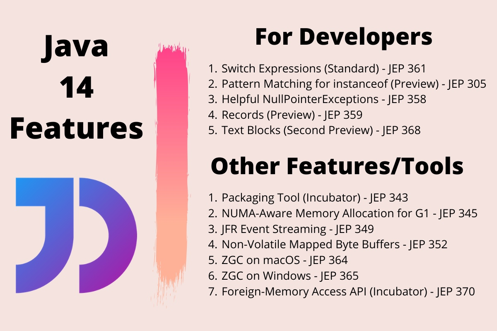
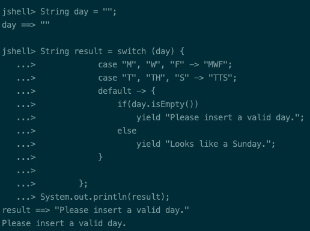
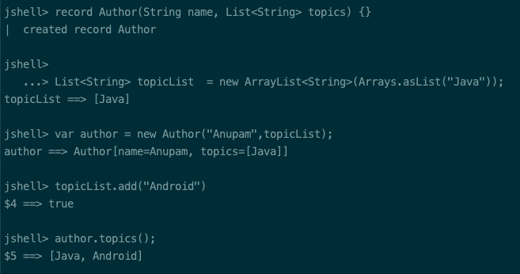
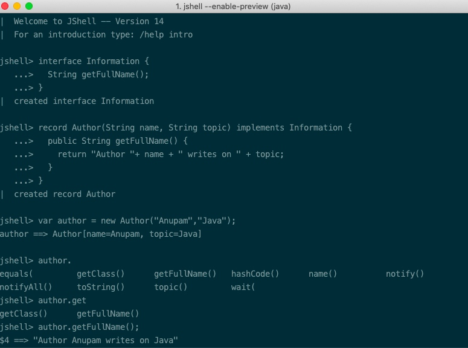
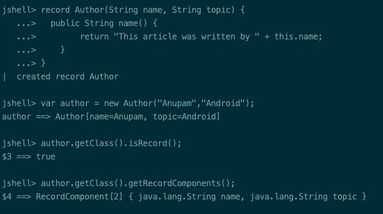

<h1 align="center">Java 14 Features</h1>




Keeping up with the six-month cycle tradition, after the release of Java 13 on September 17, 2019, Java 14, another non-LTS version is scheduled to release on March 17, 2020.

Table of Contents[[hide](https://www.journaldev.com/37273/java-14-features#)]

- [1 Java 14 Features](https://www.journaldev.com/37273/java-14-features#java-14-features)
- [2 Java 14 Installation Setup on Mac OS](https://www.journaldev.com/37273/java-14-features#java-14-installation-setup-on-mac-os)
- [3 1. Switch Expressions](https://www.journaldev.com/37273/java-14-features#1-switch-expressions)
- [4 2. Pattern Matching for instanceof (Preview)](https://www.journaldev.com/37273/java-14-features#2-pattern-matching-for-instanceof-preview)
- [5 3. Helpful NullPointerExceptions](https://www.journaldev.com/37273/java-14-features#3-helpful-nullpointerexceptions)
- 6 4. Records (Preview)
  - [6.1 4.1) Values Inside Reference Fields Of A Record Can Be Mutated](https://www.journaldev.com/37273/java-14-features#41-values-inside-reference-fields-of-a-record-can-be-mutated)
  - [6.2 4.2) Records Can Implement Interfaces](https://www.journaldev.com/37273/java-14-features#42-records-can-implement-interfaces)
  - [6.3 4.3) Records support multiple constructors](https://www.journaldev.com/37273/java-14-features#43-records-support-multiple-constructors)
  - [6.4 4.4) Records Allow Modifying Accessor Methods](https://www.journaldev.com/37273/java-14-features#44-records-allow-modifying-accessor-methods)
  - [6.5 4.5) Check Record and its Components at Runtime](https://www.journaldev.com/37273/java-14-features#45-check-record-and-its-components-at-runtime)
- [7 5. Text Blocks (Preview)](https://www.journaldev.com/37273/java-14-features#5-text-blocks-preview)

## Java 14 Features

Here’s the list of Java 14 features:

- Switch Expressions (Standard) – JEP 361
- Pattern Matching for [instanceof](https://www.journaldev.com/17136/instanceof-java) (Preview) – JEP 305
- Helpful [NullPointerExceptions](https://www.journaldev.com/14544/java-lang-nullpointerexception) – JEP 358
- Records (Preview) – JEP 359
- Text Blocks (Second Preview) – JEP 368
- Packaging Tool (Incubator) – JEP 343
- NUMA-Aware Memory Allocation for G1 – JEP 345
- JFR Event Streaming – JEP 349
- Non-Volatile Mapped Byte Buffers – JEP 352
- ZGC on macOS – JEP 364
- ZGC on Windows – JEP 365
- Foreign-Memory Access API (Incubator) – JEP 370

## Java 14 Installation Setup on Mac OS

- To get started with Java 14, download the JDK from [here](http://jdk.java.net/14/).
- Copy and extract the tar file in the `/Library/Java/JavaVirtualMachines` as shown below:

```
$ ``cd` `/Library/Java/JavaVirtualMachines` `$ ``sudo` `cp` `~``/Downloads/openjdk-14_osx-x64_bin``.``tar``.gz ``/Library/Java/JavaVirtualMachines` `$ ``sudo` `tar` `xzf openjdk-14_osx-x64_bin.``tar``.gz` `$ ``sudo` `rm` `openjdk-14_osx-x64_bin.``tar``.gz
```

Once that’s done, open the `bash_profile` using any text editor. I’m using `vim ~/.bash_profile`. Set the path of Java14 to JAVA_HOME, save changes and do a `source ~/.bash_profile` to reflect the changes.

```
export JAVA_HOME=/Library/Java/JavaVirtualMachines/jdk-14.jdk/Contents/Home
```

Finally, you’re ready to compile and run programs using Java 14. We’ll be using [JShell](https://www.journaldev.com/9879/java-repl-jshell), an interactive REPL command-line tool for quickly testing the new Java 14 features.

It’s important to note that many features released in Java 14 are in preview. This means that though they’re fully working right now, things may be modified in the future. Some could be made a standard or simply removed in the next release cycles. In order to test preview features, you need to explicitly set `--enable-preview` when running the JShell or Java Program as shown below:


```
jshell --``enable``-preview` `javac --release 14 --``enable``-preview Author.java
```

In the next few sections, let’s discuss some of the language and JVM features.

## 1. Switch Expressions

Switch Expressions after staying a preview feature in the last two releases –Java 12 and Java 13 have finally attained permanent status in Java 14.

- [Java 12](https://www.journaldev.com/28666/java-12-features) introduced the lambda syntax for switch expressions thereby allowing multiple case labels for pattern matching as well as preventing fall-throughs which lead to verbose code. It also enforced exhaustive cases wherein a compilation error would be thrown if all the input cases aren’t covered.
- [Java 13](https://www.journaldev.com/33204/java-13-features), the second preview introduced `yield` statements instead of `break` for returning values from an expression.

Java 14 has finally made these features a standard now.

```
String result = ``switch` `(day) {``      ``case` `"M"``, ``"W"``, ``"F"` `-> ``"MWF"``;``      ``case` `"T"``, ``"TH"``, ``"S"` `-> ``"TTS"``;``      ``default` `-> {``        ``if``(day.isEmpty())``          ``yield ``"Please insert a valid day."``;``        ``else``          ``yield ``"Looks like a Sunday."``;``      ``}` `    ``};``System.out.println(result);
```

Java 14 Switch Expressions

**Note**: Yield isn’t a new keyword in Java. It’s just used in switch expressions.

## 2. Pattern Matching for instanceof (Preview)

Ask any Java developer to show their codebase and you’ll a good use of `instanceof` conditions throughout the code. Specifically, an instanceof conditional check is generally followed by a typecasting.

Java 14, gets rid of this verbosity by making conditional extraction a lot more concise.

**Before Java 14:**

```
if` `(obj ``instanceof` `Journaldev) {`` ``Journaldev jd = (Journaldev) obj;`` ``System.out.println(jd.getAuthor());``}
```

**Java 14 Onwards:**

```
if` `(obj ``instanceof` `Journaldev jd) {`` ``System.out.println(jd.getAuthor());``}
```

In the above code, the instance `jd` would be only assigned if `obj` is of type `Journaldev`. The scope of the variable is limited to the conditional block only.

## 3. Helpful NullPointerExceptions

Null Pointer Exceptions are a nightmare for any developer. Previously, until Java 13, it was tricky to debug the infamous NPEs. Developers had to fall onto other debugging tools or manually figure the variable/method that was null since the stack trace would only show the line number.

**Before Java 14:**

```
String name = jd.getBlog().getAuthor()` `//Stacktrace``Exception in thread ``"main"` ``"https://www.journaldev.com/14544/java-lang-nullpointerexception"``>java.lang.NullPointerException``  ``at NullPointerExample.main(NullPointerExample.java:``5``)
```

Java 14 introduced a new JVM feature which gives better insights with a more descriptive stack as shown below:

```
Exception in thread ``"main"` `java.lang.NullPointerException: Cannot invoke ``"Blog.getAuthor()"` `because the ``return` `value of ``"Journaldev.getBlog()"` `is ``null``  ``at NullPointerExample.main(NullPointerExample.java:``4``)
```

**Note**: The above feature is not a language feature. It’s an enhancement in the runtime environment.

## 4. Records (Preview)

A record is a data class that stores pure data. The idea behind introducing records is to quickly create simple and concise classes devoid of boilerplate code.


Normally a class in Java would require you to implement `equals()`, `hashCode()` , the getters and setters methods. While some IDEs support auto-generation of such classes, the code is still verbose. With a `record` you need to simply define a class in the following way.

```
record Author(){}``//or``record Author (String name, String topic) {}
```

The Java compiler will generate a constructor, private final fields, accessors, `equals`/`hashCode` and `toString` methods automatically. The auto-generated getter methods of the above class are `name()` and `topic()`.

To look into the generated code, use `javap Author` after you’ve compiled the program using `javac`. The following illustration shows the generated class for `record Author (String name, String topic) {}`:


Javap Records Java 14

The semantics of Records is similar to [Data Classes in Kotlin](https://www.journaldev.com/18594/kotlin-data-class)

Furthermore, we can add additional fields, methods, and constructor to the record in the following way:

```
record Author (``int` `id, String name, String topic) {``  ``static` `int` `followers;` `  ``public` `static` `String followerCount() {``    ``return` `"Followers are "``+ followers;``  ``}` `  ``public` `String description(){``    ``return` `"Author "``+ name + ``" writes on "``+ topic;``  ``}` `  ``public` `Author{``  ``if` `(id < ``0``) {``    ``throw` `new` `IllegalArgumentException( ``"id must be greater than 0."``);``   ``}``  ``}``}
```

The additional constructor defined inside the record is called a Compact constructor. It doesn’t consist of any parameters and is just an extension of the canonical constructor.

A compact constructor wouldn’t be generated as a separate constructor by the compiler. Instead, it is used for validation cases and would be invoked at the start of the main constructor.

Few important things to note about Records:

- A record can neither extend a class nor it can be extended by another class. It’s a final class.
- Records cannot be abstract
- Records cannot extend any other class and cannot define instance fields inside the body. Instance fields must be defined in the state description only
- Declared fields are private and final
- The body of a record allows static fields and methods

### 4.1) Values Inside Reference Fields Of A Record Can Be Mutated

It’s important to note that for fields defined which are objects, only the reference is [immutable](https://www.journaldev.com/129/how-to-create-immutable-class-in-java). The underlying values can be modified. The following illustration shows a record in which the ArrayList is modified. As you can see, the value is modified whenever the ArrayList is changed.


Java 14 Records Mutable Values For References

### 4.2) Records Can Implement Interfaces

The following code shows an example of implementing an [interface](https://www.journaldev.com/1601/interface-in-java) with records:

```
record Author(String name, String topic) ``implements` `Information {`` ``public` `String getFullName() {``  ``return` `"Author "``+ name + ``" writes on "` `+ topic;`` ``}``}` `interface` `Information {`` ``String getFullName();``}
```

Here’s the output of the above code in action in a JShell:


Java 14 Records With Interface

### 4.3) Records support multiple constructors

Records allow declaring multiple constructors with or without parameters as shown below:

```
record Author(String name, String topic) {`` ``public` `Author() {` `  ``this``(``"NA"``, ``"NA"``);`` ``}` ` ``public` `Author(String name) {` `  ``this``(name, ``"NA"``);`` ``}``}
```

### 4.4) Records Allow Modifying Accessor Methods

Though records do generate public accessor methods for the fields defined in the state description, they also allow you to redefine the accessor methods in the body as shown below:

```
record Author(String name, String topic) {`` ``public` `String name() {``    ``return` `"This article was written by "` `+ ``this``.name;``  ``}``}
```

### 4.5) Check Record and its Components at Runtime

Records provide us with `isRecord()` and `getRecordComponents()` to check if the class is a record and also look into its fields and types. The following illustration shows how it is done:


Java 14 Records Runtime Check

While we did add additional fields and methods to the record in the above code examples, make sure you don’t overdo this. Records are designed as plain data carriers and if you’re looking to implement a lot of additional methods, it’s better to fall back onto the normal class.

## 5. Text Blocks (Preview)

Text Blocks were introduced as a preview feature in Java 13 with the goal to allow easy creation of multiline string literals. It’s useful in easily creating HTML and JSON or SQL query strings.

In Java 14, Text Blocks are still in preview with some new additions. We can now use:

- Backslash for displaying nice-looking multiline string blocks.
- `\s` is used to consider trailing spaces which are by default ignored by the compiler. It preserves all the spaces present before it.

```
String text = ``""``"``        ``Did you know \``        ``Java ``14` `\``        ``has the most features among\``        ``all non-LTS versions so far\``        ``""``";` `String text2 = ``""``"``        ``line1``        ``line2 \s``        ``line3``        ``""``";` `String text3 = ``"line1\nline2 \nline3\n"` `//text2 and text3 are equal.
```

**References**: [OpenJDK 14](https://openjdk.java.net/projects/jdk/14/)


source： https://www.journaldev.com/37273/java-14-features