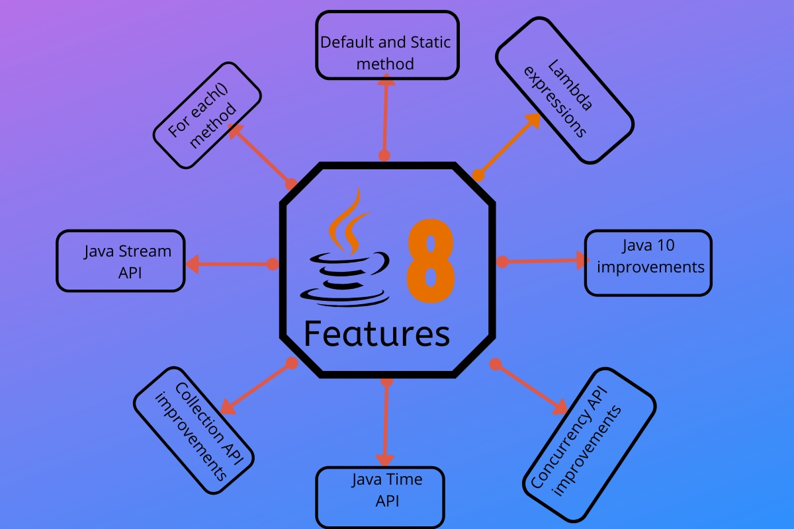

<h1 align="center">Java 8 Features</h1>



**Java 8** was released on 18th March 2014, so it’s high time to look into Java 8 Features. In this tutorial, we will look into Java 8 features with examples.

## Java 8 Features

Some of the important Java 8 features are;

1. [forEach() method in Iterable interface](https://www.journaldev.com/2389/java-8-features-with-examples#iterable-forEach)
2. [default and static methods in Interfaces](https://www.journaldev.com/2389/java-8-features-with-examples#interface-default-static-method)
3. [Functional Interfaces and Lambda Expressions](https://www.journaldev.com/2389/java-8-features-with-examples#functional-interface-lambdas)
4. [Java Stream API for Bulk Data Operations on Collections](https://www.journaldev.com/2389/java-8-features-with-examples#java-stream-api)
5. [Java Time API](https://www.journaldev.com/2389/java-8-features-with-examples#java8-time)
6. [Collection API improvements](https://www.journaldev.com/2389/java-8-features-with-examples#java8-collection)
7. [Concurrency API improvements](https://www.journaldev.com/2389/java-8-features-with-examples#java8-concurrency)
8. [Java IO improvements](https://www.journaldev.com/2389/java-8-features-with-examples#java8-io)
9. [Miscellaneous Core API improvements](https://www.journaldev.com/2389/java-8-features-with-examples#java8-core)

Let’s have a brief look on these Java 8 features. I will provide some code snippets for better understanding, so if you want to run programs in Java 8, you will have to setup Java 8 environment by following steps.

- [Download JDK8](https://www.oracle.com/technetwork/java/javase/downloads/jdk8-downloads-2133151.html) and install it. Installation is simple like other java versions. JDK installation is required to write, compile and run the program in Java.
- Download latest Eclipse IDE, it provides support for java 8 now. Make sure your projects build path is using Java 8 library.

Learning Java? Nothing better than a video course trusted by over 1,70,000 students (yes, that many students). [Follow this link](https://www.journaldev.com/java-udemy-course) to get heavy discount on the course.

1. ### forEach() method in Iterable interface

   Whenever we need to traverse through a Collection, we need to create an `Iterator` whose whole purpose is to iterate over and then we have business logic in a loop for each of the elements in the Collection. We might get [ConcurrentModificationException](https://www.journaldev.com/378/java-util-concurrentmodificationexception) if iterator is not used properly.

   Java 8 has introduced *forEach* method in `java.lang.Iterable` interface so that while writing code we focus on business logic only. *forEach* method takes `java.util.function.Consumer` object as argument, so it helps in having our business logic at a separate location that we can reuse. Let’s see forEach usage with simple example.

   ```
   package com.journaldev.java8.foreach;
   
   import java.util.ArrayList;
   import java.util.Iterator;
   import java.util.List;
   import java.util.function.Consumer;
   import java.lang.Integer;
   
   public class Java8ForEachExample {
   
   	public static void main(String[] args) {
   		
   		//creating sample Collection
   		List<Integer> myList = new ArrayList<Integer>();
   		for(int i=0; i<10; i++) myList.add(i);
   		
   		//traversing using Iterator
   		Iterator<Integer> it = myList.iterator();
   		while(it.hasNext()){
   			Integer i = it.next();
   			System.out.println("Iterator Value::"+i);
   		}
   		
   		//traversing through forEach method of Iterable with anonymous class
   		myList.forEach(new Consumer<Integer>() {
   
   			public void accept(Integer t) {
   				System.out.println("forEach anonymous class Value::"+t);
   			}
   
   		});
   		
   		//traversing with Consumer interface implementation
   		MyConsumer action = new MyConsumer();
   		myList.forEach(action);
   		
   	}
   
   }
   
   //Consumer implementation that can be reused
   class MyConsumer implements Consumer<Integer>{
   
   	public void accept(Integer t) {
   		System.out.println("Consumer impl Value::"+t);
   	}
   
   
   }
   ```

   The number of lines might increase but forEach method helps in having the logic for iteration and business logic at separate place resulting in higher separation of concern and cleaner code.


2. ### default and static methods in Interfaces

   If you read forEach method details carefully, you will notice that it’s defined in Iterable interface but we know that interfaces can’t have method body. From Java 8, interfaces are enhanced to have method with implementation. We can use `default` and `static` keyword to create interfaces with method implementation. forEach method implementation in Iterable interface is:

   ```
   	default void forEach(Consumer<? super T> action) {
           Objects.requireNonNull(action);
           for (T t : this) {
               action.accept(t);
           }
       }
   ```

   We know that Java doesn’t provide [multiple inheritance in Classes](https://www.journaldev.com/1775/multiple-inheritance-in-java) because it leads to **Diamond Problem**. So how it will be handled with interfaces now, since interfaces are now similar to abstract classes. The solution is that compiler will throw exception in this scenario and we will have to provide implementation logic in the class implementing the interfaces.

   ```
   package com.journaldev.java8.defaultmethod;
   
   @FunctionalInterface
   public interface Interface1 {
   
   	void method1(String str);
   	
   	default void log(String str){
   		System.out.println("I1 logging::"+str);
   	}
   	
   	static void print(String str){
   		System.out.println("Printing "+str);
   	}
   	
   	//trying to override Object method gives compile-time error as
   	//"A default method cannot override a method from java.lang.Object"
   	
   //	default String toString(){
   //		return "i1";
   //	}
   	
   }
   ```

   ```
   package com.journaldev.java8.defaultmethod;
   
   @FunctionalInterface
   public interface Interface2 {
   
   	void method2();
   	
   	default void log(String str){
   		System.out.println("I2 logging::"+str);
   	}
   
   }
   ```

   Notice that both the interfaces have a common method log() with implementation logic.

   ```
   package com.journaldev.java8.defaultmethod;
   
   public class MyClass implements Interface1, Interface2 {
   
   	@Override
   	public void method2() {
   	}
   
   	@Override
   	public void method1(String str) {
   	}
   
   	//MyClass won't compile without having it's own log() implementation
   	@Override
   	public void log(String str){
   		System.out.println("MyClass logging::"+str);
   		Interface1.print("abc");
   	}
   	
   }
   ```

   As you can see that `Interface1` has static method implementation that is used in `MyClass.log()` method implementation. Java 8 uses **default** and **static** methods heavily in [**Collection API**](https://www.journaldev.com/1260/collections-in-java-tutorial) and default methods are added so that our code remains backward compatible.

   If any class in the hierarchy has a method with the same signature, then default methods become irrelevant. Since any class implementing an interface already has Object as a superclass, if we have equals(), hashCode() default methods in the interface, it will become irrelevant. That’s why for better clarity, interfaces are not allowed to have Object default methods.

   For complete details of interface changes in Java 8, please read [Java 8 interface changes](https://www.journaldev.com/2752/java-8-interface-changes-static-method-default-method).


3. ### Functional Interfaces and Lambda Expressions

   If you notice above interfaces code, you will notice @FunctionalInterface [annotation](https://www.journaldev.com/721/java-annotations). Functional interfaces are new concept introduced in Java 8. An interface with exactly one abstract method becomes Functional Interface. We don’t need to use @FunctionalInterface annotation to mark an interface as Functional Interface. @FunctionalInterface annotation is a facility to avoid accidental addition of abstract methods in the functional interfaces. You can think of it like [@Override annotation](https://www.journaldev.com/817/java-override-method-overriding) and it’s best practice to use it. `java.lang.Runnable` with single abstract method run() is a great example of functional interface.

   One of the major benefits of functional interface is the possibility to use **lambda expressions** to instantiate them. We can instantiate an interface with [anonymous class](https://www.journaldev.com/996/java-inner-class) but the code looks bulky.

   ```
   Runnable r = new Runnable(){
   			@Override
   			public void run() {
   				System.out.println("My Runnable");
   			}};
   ```

   Since functional interfaces have only one method, lambda expressions can easily provide the method implementation. We just need to provide method arguments and business logic. For example, we can write above implementation using lambda expression as:

   ```
   Runnable r1 = () -> {
   			System.out.println("My Runnable");
   		};
   ```

   If you have single statement in method implementation, we don’t need curly braces also. For example above Interface1 anonymous class can be instantiated using lambda as follows:

   ```
   Interface1 i1 = (s) -> System.out.println(s);
   		
   i1.method1("abc");
   ```

   So lambda expressions are a means to create anonymous classes of functional interfaces easily. There are no runtime benefits of using lambda expressions, so I will use it cautiously because I don’t mind writing a few extra lines of code.

   A new package `java.util.function` has been added with bunch of functional interfaces to provide target types for lambda expressions and method references. Lambda expressions are a huge topic, I will write a separate article on that in the future.

   You can read complete tutorial at [Java 8 Lambda Expressions Tutorial](https://www.journaldev.com/2763/java-8-functional-interfaces).


4. ### Java Stream API for Bulk Data Operations on Collections

    A new `java.util.stream` has been added in Java 8 to perform filter/map/reduce like operations with the collection. Stream API will allow sequential as well as parallel execution. This is one of the best features for me because I work a lot with Collections and usually with Big Data, we need to filter out them based on some conditions.

    Collection interface has been extended with *stream()* and *parallelStream()* default methods to get the Stream for sequential and parallel execution. Let’s see their usage with simple example.

    ```
    package com.journaldev.java8.stream;
    
    import java.util.ArrayList;
    import java.util.List;
    import java.util.stream.Stream;
    
    public class StreamExample {
    
    	public static void main(String[] args) {
    		
    		List<Integer> myList = new ArrayList<>();
    		for(int i=0; i<100; i++) myList.add(i);
    		
    		//sequential stream
    		Stream<Integer> sequentialStream = myList.stream();
    		
    		//parallel stream
    		Stream<Integer> parallelStream = myList.parallelStream();
    		
    		//using lambda with Stream API, filter example
    		Stream<Integer> highNums = parallelStream.filter(p -> p > 90);
    		//using lambda in forEach
    		highNums.forEach(p -> System.out.println("High Nums parallel="+p));
    		
    		Stream<Integer> highNumsSeq = sequentialStream.filter(p -> p > 90);
    		highNumsSeq.forEach(p -> System.out.println("High Nums sequential="+p));
    
    	}
    
    }
    ```

    If you will run above example code, you will get output like this:

    ```
    High Nums parallel=91
    High Nums parallel=96
    High Nums parallel=93
    High Nums parallel=98
    High Nums parallel=94
    High Nums parallel=95
    High Nums parallel=97
    High Nums parallel=92
    High Nums parallel=99
    High Nums sequential=91
    High Nums sequential=92
    High Nums sequential=93
    High Nums sequential=94
    High Nums sequential=95
    High Nums sequential=96
    High Nums sequential=97
    High Nums sequential=98
    High Nums sequential=99
    ```

    Notice that parallel processing values are not in order, so parallel processing will be very helpful while working with huge collections.
    Covering everything about Stream API is not possible in this post, you can read everything about Stream API at [Java 8 Stream API Example Tutorial](https://www.journaldev.com/2774/java-8-stream).


5. ### Java Time API

    It has always been hard to work with Date, Time and Time Zones in java. There was no standard approach or API in java for date and time in Java. One of the nice addition in Java 8 is the `java.time` package that will streamline the process of working with time in java.

    Just by looking at Java Time API packages, I can sense that it will be very easy to use. It has some sub-packages `java.time.format` that provides classes to print and parse dates and times and `java.time.zone` provides support for time-zones and their rules.

    The new Time API prefers enums over integer constants for months and days of the week. One of the useful class is `DateTimeFormatter` for converting DateTime objects to strings.

    For complete tutorial, head over to [Java Date Time API Example Tutorial](https://www.journaldev.com/2800/java-8-date-localdate-localdatetime-instant).


6. ### Collection API improvements

    We have already seen forEach() method and Stream API for collections. Some new methods added in Collection API are:

    - `Iterator` default method `forEachRemaining(Consumer action)` to perform the given action for each remaining element until all elements have been processed or the action throws an exception.
    - `Collection` default method `removeIf(Predicate filter)` to remove all of the elements of this collection that satisfy the given predicate.
    - `Collection` `spliterator()` method returning Spliterator instance that can be used to traverse elements sequentially or parallel.
    - Map `replaceAll()`, `compute()`, `merge()` methods.
    - Performance Improvement for HashMap class with Key Collisions


7. ### Concurrency API improvements

    Some important concurrent API enhancements are:

    - `ConcurrentHashMap` compute(), forEach(), forEachEntry(), forEachKey(), forEachValue(), merge(), reduce() and search() methods.
    - `CompletableFuture` that may be explicitly completed (setting its value and status).
    - `Executors` `newWorkStealingPool()` method to create a work-stealing thread pool using all available processors as its target parallelism level.


8. ### Java IO improvements

    Some IO improvements known to me are:

    - `Files.list(Path dir)` that returns a lazily populated Stream, the elements of which are the entries in the directory.
    - `Files.lines(Path path)` that reads all lines from a file as a Stream.
    - `Files.find()` that returns a Stream that is lazily populated with Path by searching for files in a file tree rooted at a given starting file.
    - `BufferedReader.lines()` that return a Stream, the elements of which are lines read from this BufferedReader.


9. ### Miscellaneous Core API improvements

    Some misc API improvements that might come handy are:

    1. [ThreadLocal](https://www.journaldev.com/1076/java-threadlocal-example) static method withInitial(Supplier supplier) to create instance easily.
    2. [Comparator](https://www.journaldev.com/780/comparable-and-comparator-in-java-example) interface has been extended with a lot of default and static methods for natural ordering, reverse order etc.
    3. min(), max() and sum() methods in Integer, Long and Double wrapper classes.
    4. logicalAnd(), logicalOr() and logicalXor() methods in Boolean class.
    5. [ZipFile](https://www.journaldev.com/957/java-zip-file-folder-example).stream() method to get an ordered Stream over the ZIP file entries. Entries appear in the Stream in the order they appear in the central directory of the ZIP file.
    6. Several utility methods in Math class.
    7. `jjs` command is added to invoke Nashorn Engine.
    8. `jdeps` command is added to analyze class files
    9. JDBC-ODBC Bridge has been removed.
    10. PermGen memory space has been removed

That’s all for Java 8 features with example programs. If I have missed some important features of Java 8, please let me know through comments.

source：https://www.journaldev.com/2389/java-8-features-with-examples