## Awsome-Mind

思维导图也叫心智图，是一项流行的全脑式学习方法，用来表示词，思路，任务或其他与围绕着一个中央关键词或想法项目的示意图。通过径向，图形和非线性的方式提出意见，思维导图鼓励头脑风暴的方法来规划和组织任务。

## 数据结构和算法

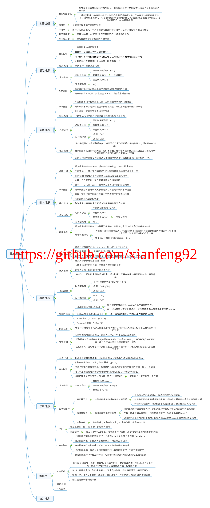

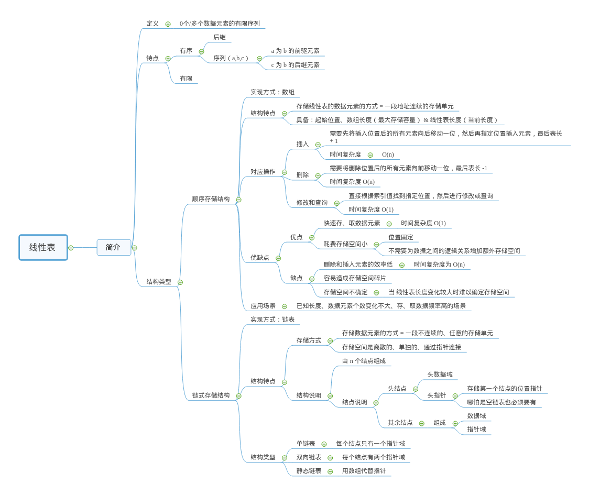

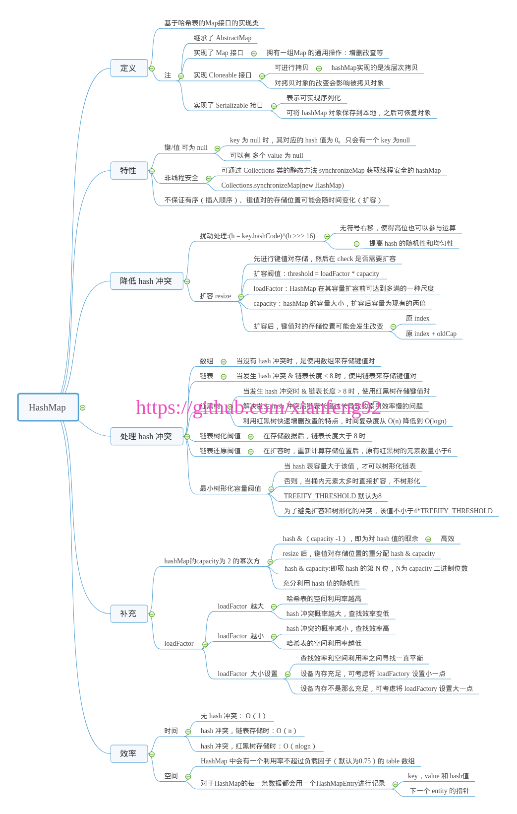

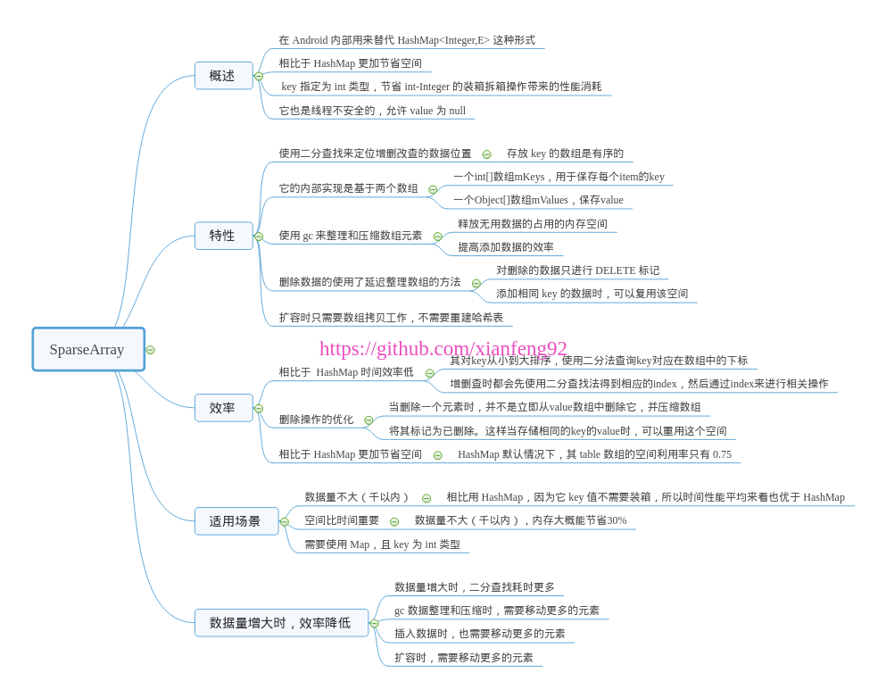

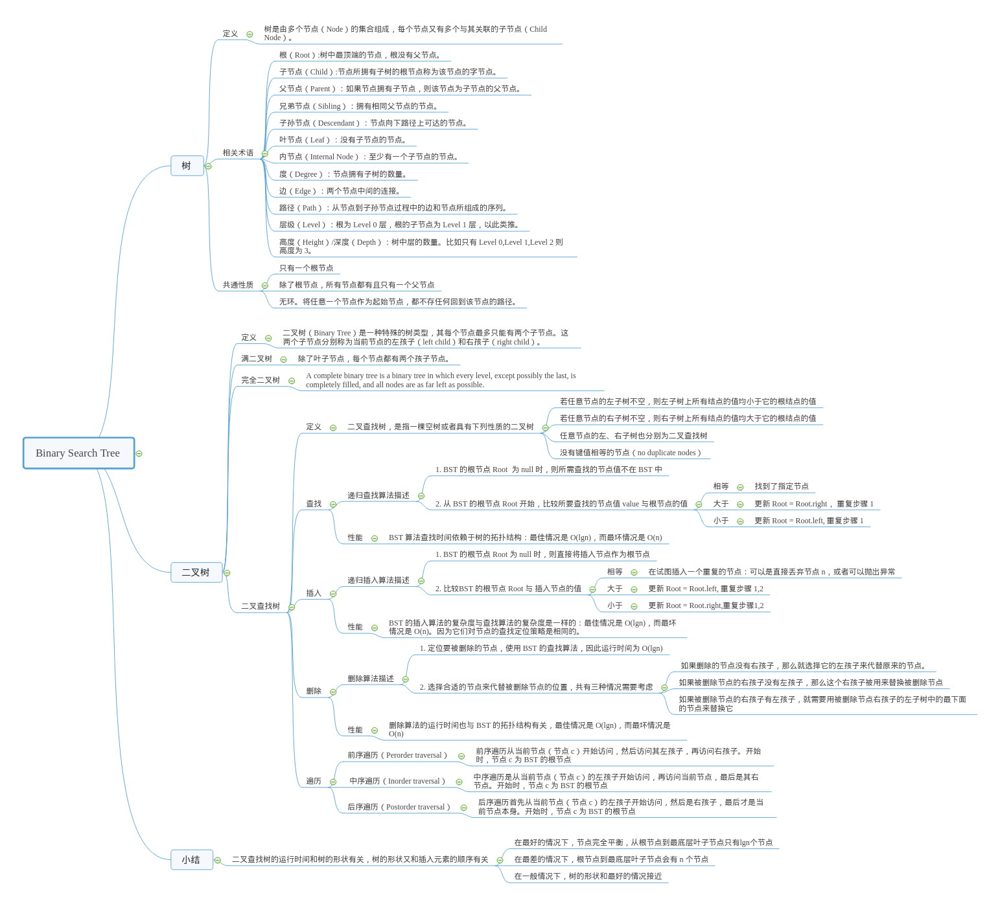

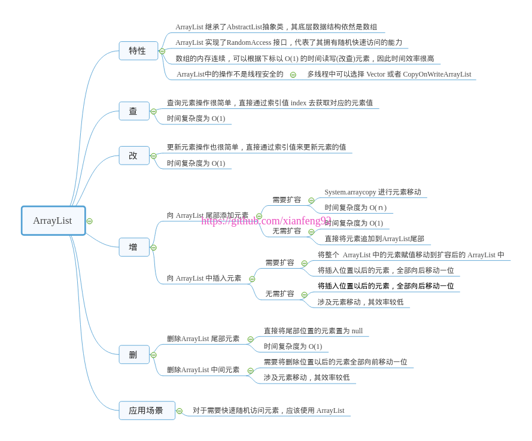

## Android

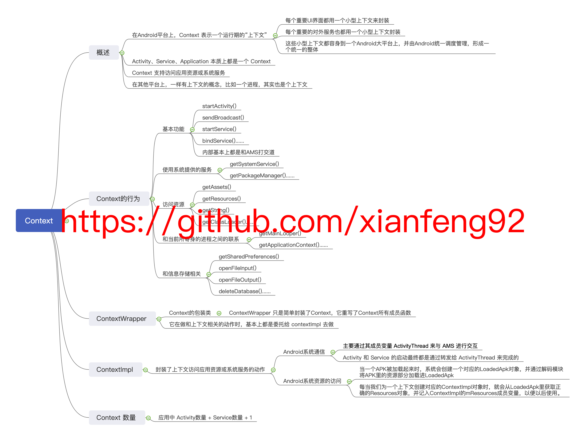

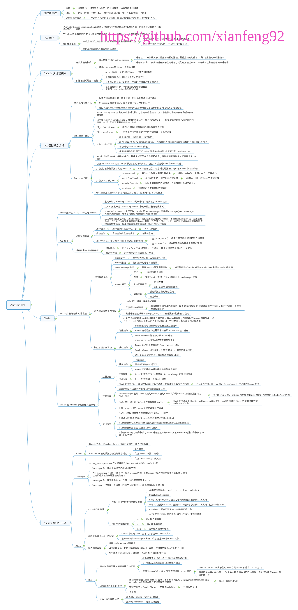

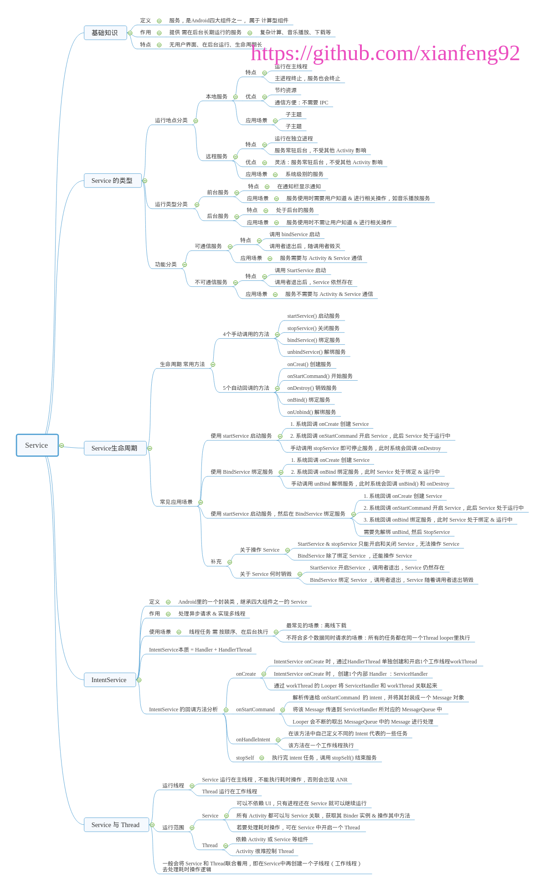

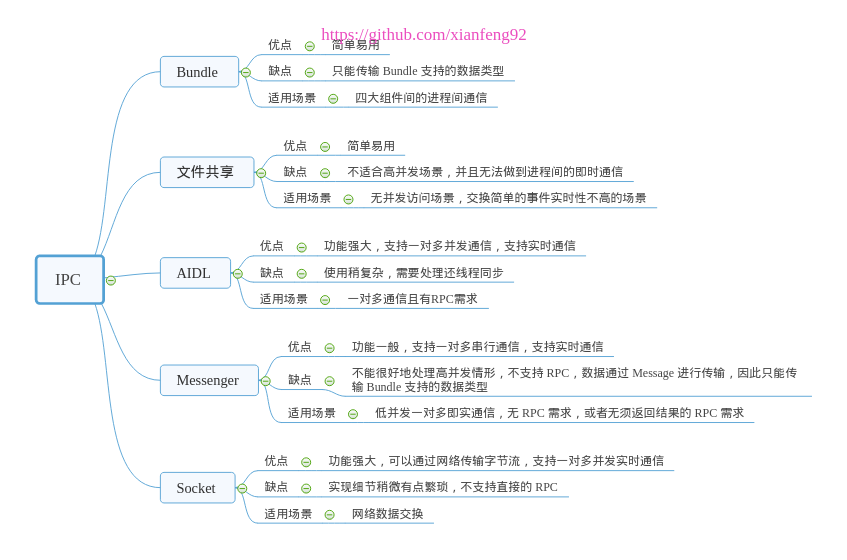

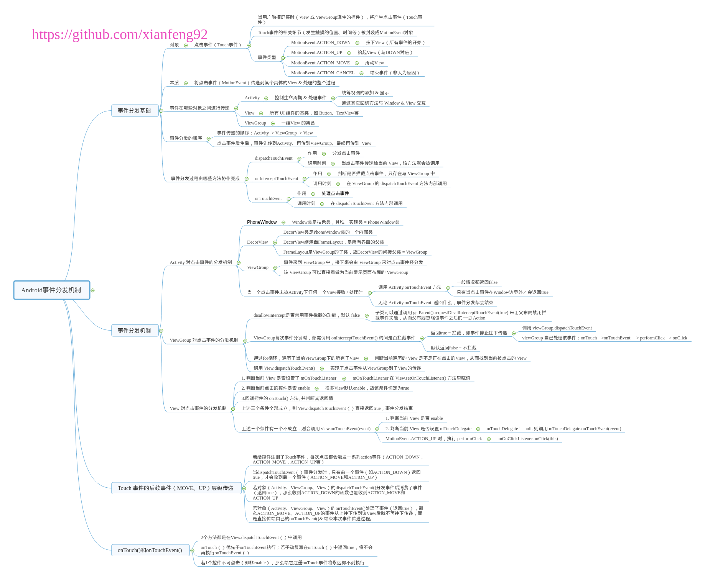

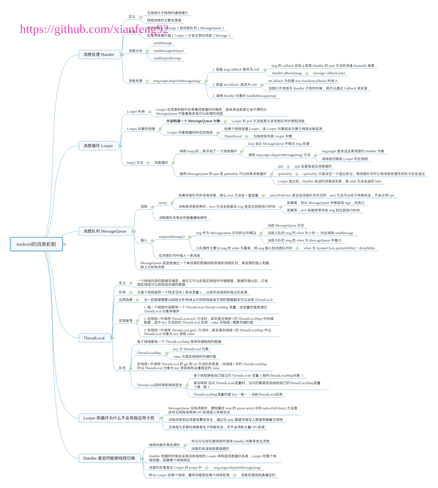

## Flutter

* 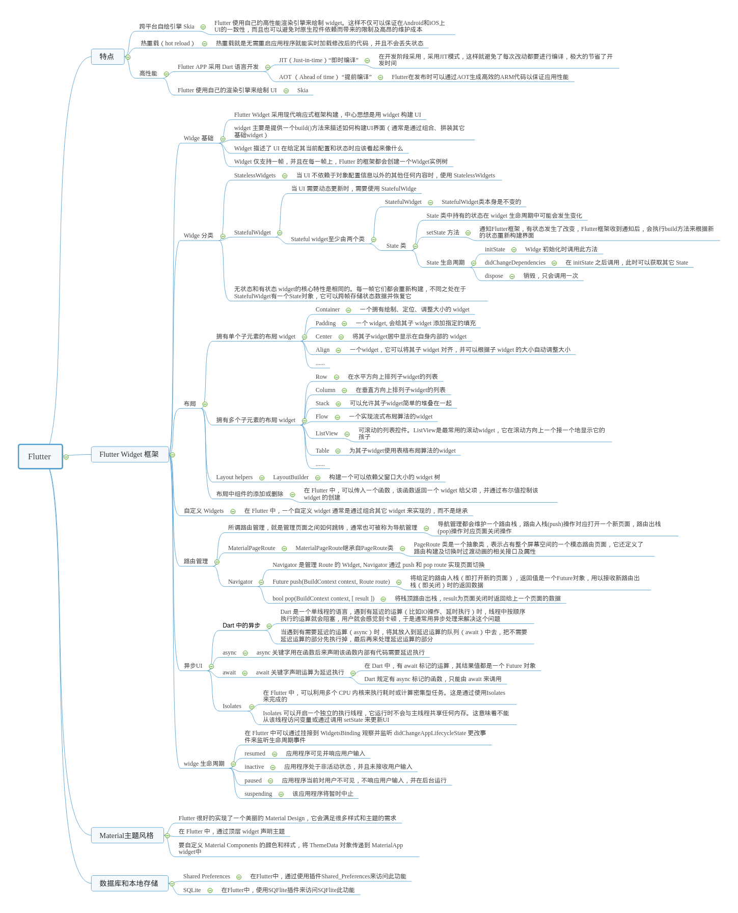

## 来源

* [xianfeng92/Awsome-Mind: Use Mind-Note to record Software development techniques (github.com)](https://github.com/xianfeng92/Awsome-Mind)
