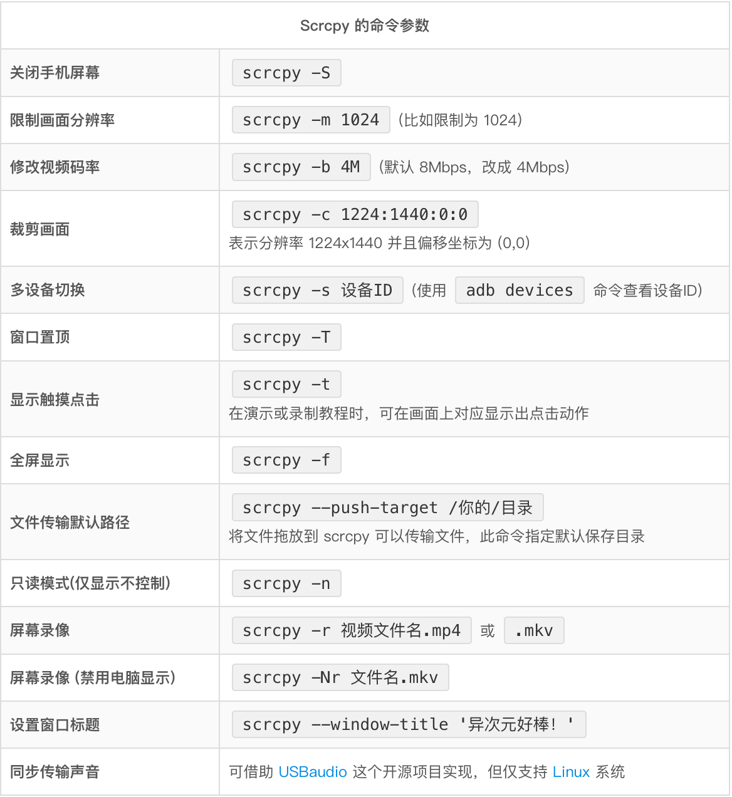
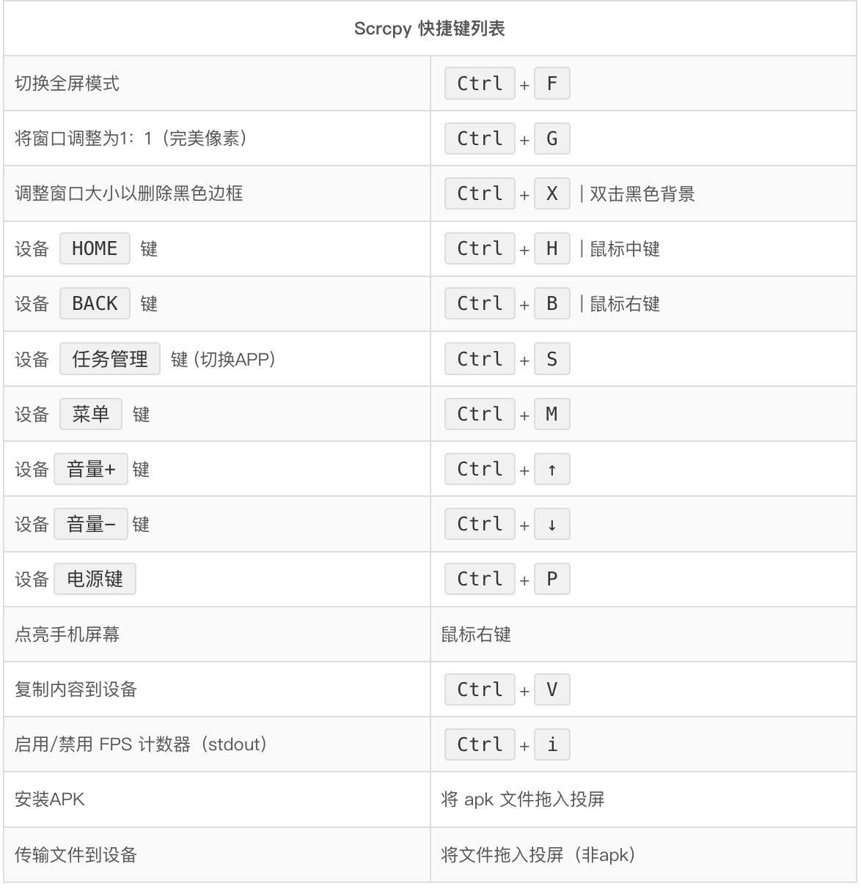

# Scrcpy使用命令

#### 安装和启动
```
// 安装
brew install scrcpy

// 启动
scrcpy

// 如果没有ADB则需要执行下面命令安装ADB
brew cask install android-platform-tools
```

#### 操作
##### Scrcpy 一些实用的命令参数：

这些参数可以多个自由组合使用，注意**区分大小写**。



##### Scrcpy 使用与快捷键：

启动之后，你就可以在电脑桌面上看到 Scrcpy 的投屏窗口和手机画面了，你可以直接用鼠标进行操作，它同时也有很多键盘快捷键可以使用。



##### 屏幕录像

如有需要，你也可以通过命令对连接好的安卓手机进行录屏，并将视频保存为 .mp4 格式。

投屏并录屏：
```
scrcpy -r file.mp4
```

不投屏只录屏：
```
scrcpy -Nr file.mp4
```

##### 使用 WIFi 无线连接：

Scrcpy 使用 adb 与 Android 设备通讯，而 adb 本身是支持无线连接的。因此除了 USB 数据线之外，我们也能无线使用。前提是需要保证手机和电脑处于同一局域网 (连接到相同的 WiFi 路由器)，步骤如下：

1. 查询设备当前的 IP 地址 (设置 →关于手机→状态)
2. 启用 adb TCP/IP 连接，执行命令：adb tcpip 5555，其中 5555 为端口号
3. 拔掉你的数据线
4. 通过 WiFi 进行连接，执行命令：adb connect 设备IP地址:5555
5. 重新启动 scrcpy 即可
6. 如果 WiFi 较慢，可以调整码率：scrcpy -b 3M -m 800，意思是限制 3 Mbps，画面分辨率限制 800，数值可以随意调整。
7. 如需切换回 USB 模式，执行：adb usb

#### 项目地址
[https://github.com/Genymobile/scrcpy](https://github.com/Genymobile/scrcpy)